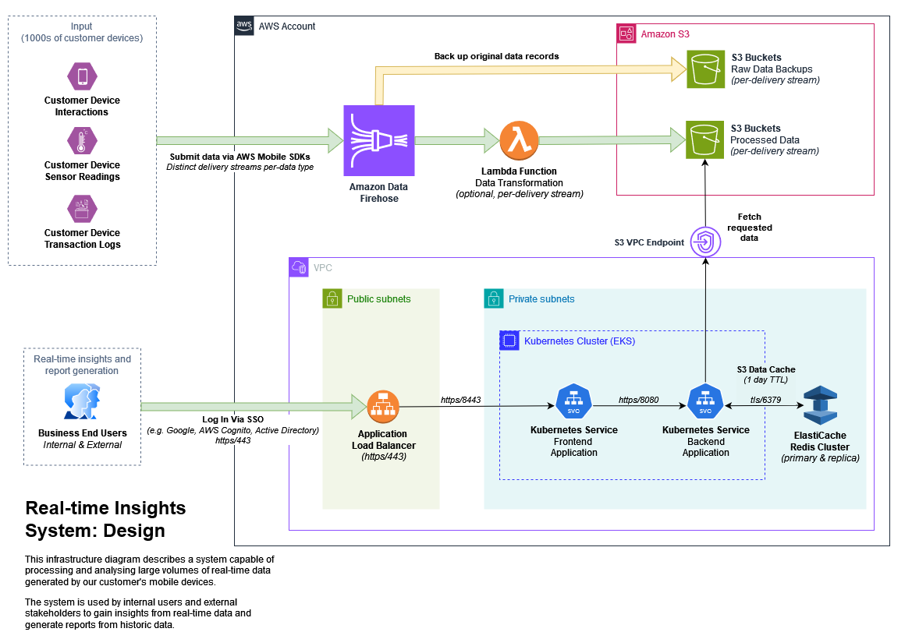

# Overview
## Description
A cloud infrastructure design for a proposed system to process and analyse
large volumes of real-time data from our customers' mobile devices.

## Assumptions
For this design, I've assumed the following:

* Total customer devices number in the thousands and is likely to increase.

* A definition of "real-time" as "within seconds" is considered acceptable.

* Data submission rate is less than 2,000 requests/second and 5MiB/second

* Total data storage volume ranges between terabytes (TB) and petabytes (PB)

* An approach using Amazon Web Services (AWS) is preferred.

* Containerised services can be run using cloud-native solutions (Kubernetes).

* The company already has a preferred single sign-on provider.

# Diagram

# Design
## System Input
The inputs to this system are customer "interactions", "sensor readings" and
"transaction logs", all generated by our mobile app which is installed on a 
range of consumer mobile devices used by our customers.

Data is submitted to the system by our mobile app using the AWS Mobile SDKs,
which have APIs capable of sending data records to Amazon Data Firehose. Data
records are submitted once per minute from each device, per data-source type.

## Streaming Data Ingestion & Processing
Incoming data is received by Amazon Data Firehose, which is a managed
service capable of processing and delivering real-time streaming data to a
storage location.

In this case, the "processing" of incoming data is taken to mean inspection,
transformation and delivery of source records to an object store (Amazon S3), 
which can then be accessed by applications to provide insight into the 
submitted data or be used by report generation processes.

Distinct "streams" can be configured within this service, which allows for
us to submit our different classes of submitted data to separate locations.
This allows for more flexibility around data transformation and the storage 
destination.

In this system, we will have three streams - one per data input class. Each 
stream will ultimately deliver its data to a distinct S3 bucket. Data is 
organised into directories based on the submission timestamp of the record. 
This allows us to to access data records straightforwardly by time. 

Dynamic provisioning can be configured if it makes sense to organise data by
another attribute of the submitted payload, such as customer or device ID.

Prior to processing, all raw data records submitted are backed up to a 
separate S3 location. This ensures that the original data can be reprocessed 
in the future, should the requirements of the processing change over time.

Streams can transform data that is submitted to their delivery to S3 by using
an AWS Lambda function. A "buffer" of data from the Stream is submitted to
each Lambda invocation, which is configurable in size. We can write the Lambda
function in whichever language we have expertise with that Lambda supports.

The exact transformations performed on incoming data are outside the scope
of this design, but this design allows for the inspection of payloads and
for transformation actions to be represented in the code of the Lambda 
function. If detailed transformation actions beyond record organisation are
not required, the Lambda function can be omitted from the proposed system.

## System Outputs
The system provides access to both real-time insight of collected data and
the ability to generate reports on-demand to internal and external stakeholders.

To achieve this, a front-end application is responsible for displaying a web
interface to the user that they can log into (via our preferred single sign-on 
system) and request insights or reports from. Requests for specific real-time 
views or reports are submitted to a back-end application via a RESTful API 
call.

The back-end application is responsible for responding to API requests from the
front-end application. It then fetches the relevant data from the correct S3
bucket(s) and returns it to the front-end in a format that can be used to 
display it to the user. Large responses are paginated appropriately.

To improve performance and cost-effectiveness, fetched data is cached for a
period of time in an ElastiCache Redis cluster. Data is written to the cache
by the back-end application after fetching with a TTL of 1 day, after which it
expires and is deleted. If re-requested after this, it is fetched again by 
the back-end application from S3. This means cached data remains ephemeral and 
also keeps locally stored data volumes low, reducing costs.

## Detailed Design Considerations
### Security
Customer devices which communicate with the AWS Data Firehose streams are
permitted to so via IAM policy permissions. The usual model is for devices
to be a part of an Amazon Cognito identity pool. An IAM policy granting access
to put records onto each stream is associated with the identity pool's role.
No other actions upon any other AWS resources can be performed. No other
devices or systems can submit data to the AWS Data Firehose.

Data submitted by user devices to Amazon Data Firehose, and data transmitted
within Amazon Data Firehose is encrypted in-transit by TLS. Data that touches
disk within the Amazon Data Fire Hose streams is encrypted at rest using 
Amazon KMS keys and server-side encryption.

Data stored in all S3 buckets is encrypted at-rest with Amazon KMS keys and
server-side encryption. Read/write access is locked down to only services that
require it (e.g. Amazon Data Firehose, the Lambda data transformation function
and the back-end application) via IAM policies. The principal-of-least 
privilege is observed.

Traffic between business users and the front-end application is encrypted 
in-transit with TLS. The single sign-on provider is responsible for storage of 
sensitive information such as usernames, email addresses and passwords.
Using a single sign-on provider for this purpose outsources responsibility for
the security of application authentication, limiting the need to build this
in-house.

The front-end service is exposed publicly via an Application Load Balancer
provisioned by an Ingress and the AWS Load Balancer Controller. The load
balancer can communicate with the front-end service pods via security group
configuration.

Traffic to the front-end application is encrypted all the way through to the
application pod. TLS is not terminated at the load balancer. Both front-end 
and back-end containers are configured to speak HTTPS using LetsEncrypt issued 
certificates with the `cert-manager` cluster component.

Neither the front-end and back-end application pods are publicly accessible.
They are scheduled on Kubernetes nodes which are provisioned in private 
subnets. The applications are configured to communicate with each other via
Kubernetes NetworkPolicies and traffic remains internal to the cluster.

The ElastiCache Redis cluster is provisioned in private subnets within the VPC,
meaning it is not publicly accessible. Security group rules ensure that only
the back-end application pods can communicate with it via port tcp/6379. TLS is 
used to secure data transmission, and authentication is required.

Traffic between the back-end application and ElastiCache Redis cluster is
encrypted in-transit with TLS. At-rest encryption in the ElastiCache Redis
cluster is achieved via AWS KMS.

Traffic between the back-end application and AWS S3 never leaves the AWS cloud
thanks to a VPC Endpoint being configured within the VPC.

### Performance
Automatic scaling of AWS Data Firehose streams occurs to match incoming data 
submission rates. This ensures that the system can handle spikes in data volume 
without compromising on performance. In this way, we can support submission of
data from many thousands or even millions of user devices.

Each AWS Data Firehose stream has default quota of 500,000 requests/second,
2,000 API requests/second and 5 MiB/s of submitted data. These can be increased
through a request to AWS Support.

Records submitted to AWS Data Firehose are delivered to S3 whenever either its
buffer time or buffer size are breached. At a minimum, the buffering interval
can be configured to 0 seconds, which means data is delivered to S3 within a 
few seconds.

AWS Lambda supports invocation of tens of thousands of concurrent executions,
meaning that this will be unlikely to bottleneck the design. The default quota
is 1,000 concurrent executions. Executions can complete in milliseconds if
optimised correctly.

AWS S3's storage capacity is effectively unlimited, meaning that increases in
our customer-base will require no actions to scale storage as we grow. Given the
anticipated data volumes of this system (TB to PB range), this is the most
feasible option from an operational standpoint.

Both front-end and back-end application Deployments have been configured to be 
horizontally auto-scalable based on CPU and memory utilisation to handle spikes 
in activity during busy periods, and contraction and saving of resources in 
quiet periods.

Transfer speeds from the back-end application and Amazon S3 are improved through
the use of a VPC Endpoint, which keeps all data transfer operations within the
AWS cloud. This removes the need for traffic to S3 to exit the VPC.

It is accepted that data transfer between the back-end application and AWS S3 is
likely the bottleneck of this system. Large reports requested by business users
could require a large amount of data to be fetched to compile them. The impact
of this is mitigated through local caching of frequently accessed data within
the ElastiCache Redis cluster, ensuring that a performance hit incurred for only
the first generation of a report up to the cache's TTL value. Sizing of this
cluster will need to be monitored closely to match business demand - sufficient
memory is necessary for the cache to remain effective.

### Reliability
As a managed service, AWS Data Firehose is highly available by design without 
any configuration or input. It runs in a serverless fashion, and thus no VPC 
configuration is required. Its actions can be restricted through IAM, however.

AWS Data Firehose allows us to back up received records to S3 before 
transformation and delivery to their destination. Either all records, or just 
those failed to be delivered can be backed up in this way. In this system, it
is proposed that we back up everything. Our raw data is valuable - we may wish 
to reprocess it in different ways later. By configuring backups, we ensure 
protection against data loss.

AWS Lambda is a fully managed service and requires no specific configuration for
resilience. Underlying systems that functions run on are already fault tolerant.

No data of value is stored outside of Amazon S3. Amazon S3 is an extremely 
robust storage location. Data stored on S3 is stored redundantly across multiple
devices in multiple availability zones. In this way, it provides extremely high 
durability and availability of data.

Deploying our front-end and back-end applications on Kubernetes allows for them
to be made fault-tolerant and self-healing by design. Many of the main features
of using Kubernetes centre around high-availability, self-healing and 
fault-tolerance. Ensuring pods are ephemeral is also highly encouraged.

Both front-end and back-end applications are configured as such that they run 
multiple replicas. Three pods will be run at a minimum, with Pod Topology Spread 
Constraints configured to ensure that they do not run on nodes in the same 
availability zone. This increases the fault-tolerance of the application.

The ElastiCache cluster has been provisioned with two cluster nodes for
redundancy and to minimise the impact of failure - if the primary fails, the
backup will be promoted. Data backups are not configured, as all data is 
ephemeral and temporary and can be re-built/re-fetched as required.

### Cost Efficiency
With AWS Data Firehose, pricing is applied on data volumes ingested over the 
course of a month. The first 500 TB ingested in a month costs around three cents
per-GB and drops thereafter. In this way, we only pay for what we use.

Amazon S3 data storage costs are as low as any comparable solution. Attempting 
to self-build a storage solution with TB/PB capacity requirements and keeping 
our data safe is likely impossible to achieve in any other way without spending
a significant sum. Storage of a TB of data costs around $24 per month at its 
most expensive.

As such, the more data we store on S3, the more we need to spend to store it.
To reduce this cost, we could configure S3 lifecycle rules to automatically move
old data into a lower-cost storage class (e.g. Glacier). This is particularly 
suitable for the raw record backups, which will likely be very rarely accessed.
If we don't need to retain data for more than a certain period (e.g. years), we 
can also configure a rule which deletes data when it becomes older than that 
period. Configuring this would limit the growth of the system's storage costs.

Data transfer costs between the back-end application and Amazon S3 have been
eliminated through use of a VPC Endpoint - this ensures all data transferred 
remains within the AWS cloud, ensuring transfer costs are not incurred.

The front-end and back-end containers used in this system is suitable to be 
run on spot instances provisioned via a dynamic provisioner such as Karpenter. 
This allows for cost savings to be made on compute provisioning costs.

Cost of maintaining the ElastiCache Redis cluster can be offset through the use
of reserved nodes once we're comfortable that they are sized correctly.

# Contributing
## General
Please submit a pull request. 

Ensure CI checks pass prior to requesting review.

Checks consist of syntax checks on diagram files and spell-checks of this file.

## Updating Diagrams
To create this diagram, [draw.io](https://app.diagrams.net/) was used.

The source of this diagram is available within the `diagram.drawio` file.

This is an XML file that you are unlikely to be able to adjust with an editor.

Documentation on how to perform updates using the tool can be found below.

### Opening / Editing
To edit it, perform the following:

1. Access [draw.io](https://app.diagrams.net/) in a recent browser.
2. Choose your desired diagram storage location ("Device" is usually fine).
3. Select **Open Existing Diagram**
4. Select the `diagram.drawio` file from this repository.

Make the desired changes to the diagram.

### Saving / Exporting
After editing the diagram, save a new version of the XML document, and export
a rendered version in `.png` format, then and add to a pull request.

To save a copy of the `.drawio` XML file:

1. Select **File** -> **Save As** 
2. Choose the type **XML File (.drawio)**
3. Choose the location **Download**.
4. Press **OK**.

To export a `.png` rendering of the diagram:

1. Select **File** -> **Export as** -> **PNG...**
2. Use the default settings and press **Export**

Files are saved to your Downloads folder. Commit these in your pull request.
